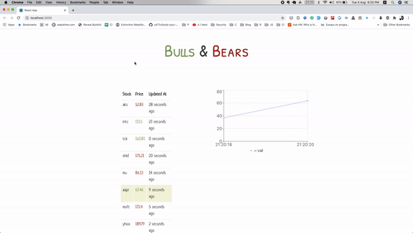

# Bulls & Bears

## Objective

The program displays stocks in realtime within a table and a graph

## Assumptions

1. The user selects a single stock.
2. The stock data varies in realtime on the table.
3. The graph gets updated when selecting any particular stock.

## Stack

1. ReactJS
2. Typescript
3. Enzyme for Testing

## How To Run Locally

1. git clone <git url>
2. yarn install
3. yarn start

## Testing:

To test run `npm test`

## Demo

The demo website is deployed at <a href="http://www.yatin.space/bnb/" target="_blank">Github Pages</a>

## Status

